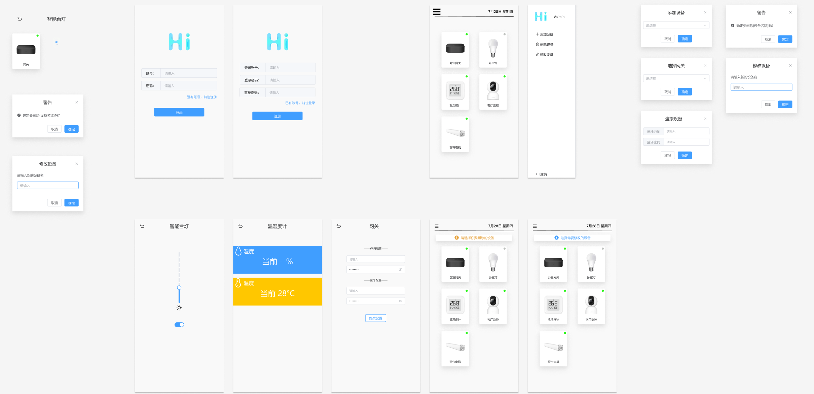

# HiHome

HiHome is a smart home project that includes a gateway, frontend, backend, and some hardware devices for demonstration purposes. It supports HTTP, MQTT, and Bluetooth communication.

## Demo Video
https://www.bilibili.com/video/BV1uk4y1v7fC/

## UI Design
https://www.figma.com/community/file/1224727360969134216/HiHomeWebUI


## Startup

### Frontend

```
npm install
```

Compiles and hot-reloads for development

```
npm run serve
```

Compiles and minifies for production

```
npm run build
```

Lints and fixes files

```
npm run lint
```

See [Configuration Reference](https://cli.vuejs.org/config/) for customize configuration.


### Backend

see [egg docs][egg] for more detail.

Development

```bash
$ npm i
$ npm run dev
$ open http://localhost:7001/
```

Deploy

```bash
$ npm start
$ npm stop
```

npm scripts

- Use `npm run lint` to check code style.
- Use `npm test` to run unit test.
- Use `npm run autod` to auto detect dependencies upgrade, see [autod](https://www.npmjs.com/package/autod) for more detail.


### Gateway

A gateway based on ESP32 that supports MQTT and Bluetooth communication.

After compiling the code, it can be burned onto the ESP32.


