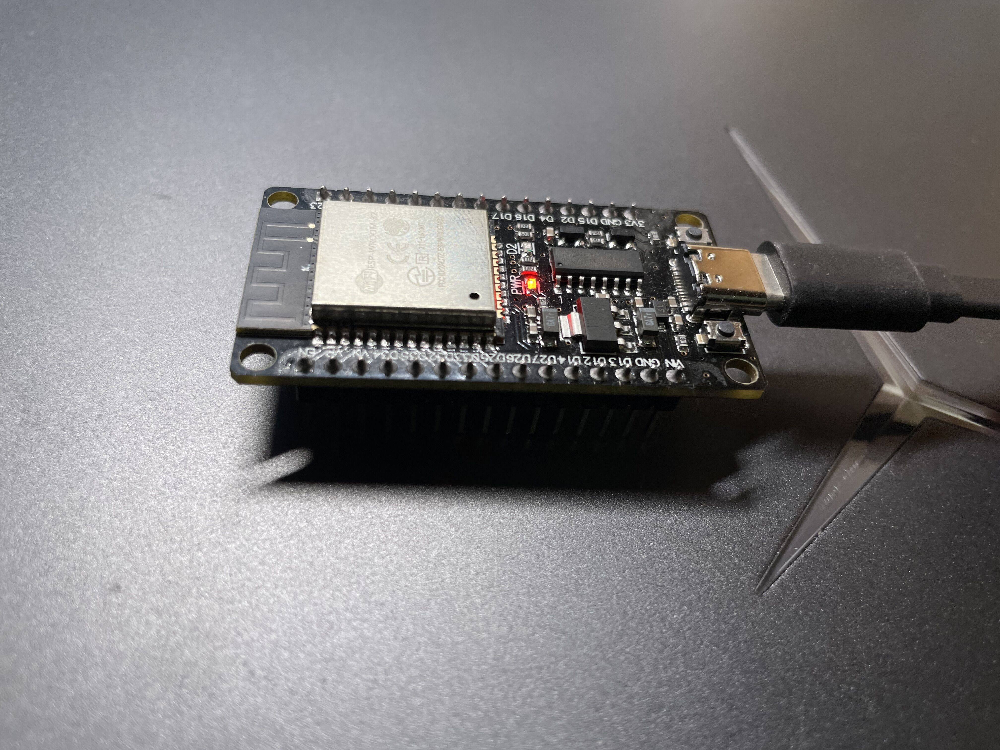

# Hi-Gateway
A gateway based on ESP32 that supports MQTT and Bluetooth communication.

## Project presentation
https://www.bilibili.com/video/BV1uk4y1v7fC

## Run
After compiling the code, it can be burned onto the ESP32.

