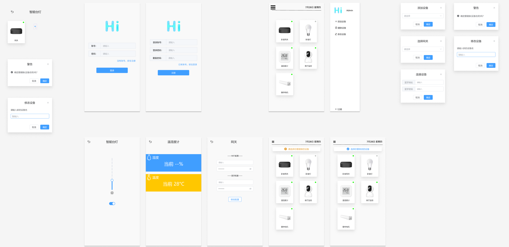

# Hi-Webclient

## Project presentation
https://www.bilibili.com/video/BV1uk4y1v7fC/

## UI Design
https://www.figma.com/community/file/1224727360969134216/HiHomeWebUI


## Project setup
```
npm install
```

### Compiles and hot-reloads for development
```
npm run serve
```

### Compiles and minifies for production
```
npm run build
```

### Lints and fixes files
```
npm run lint
```

### Customize configuration
See [Configuration Reference](https://cli.vuejs.org/config/).
